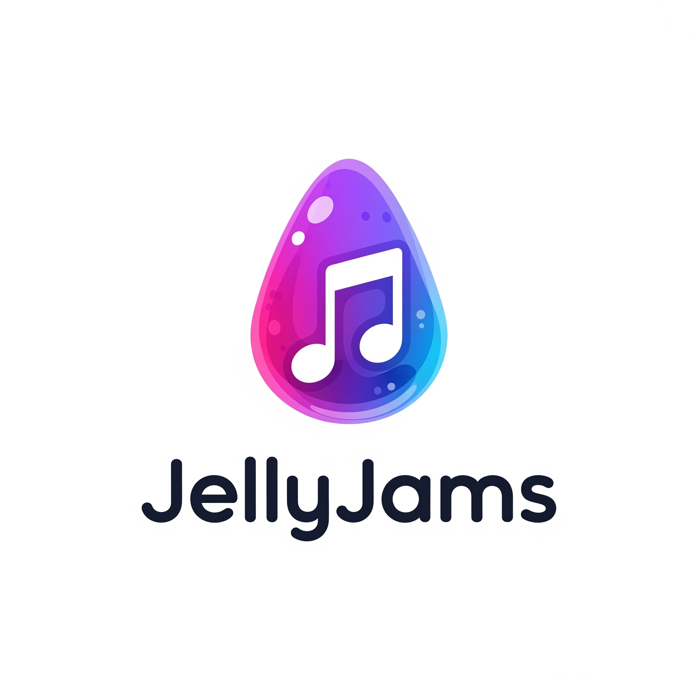
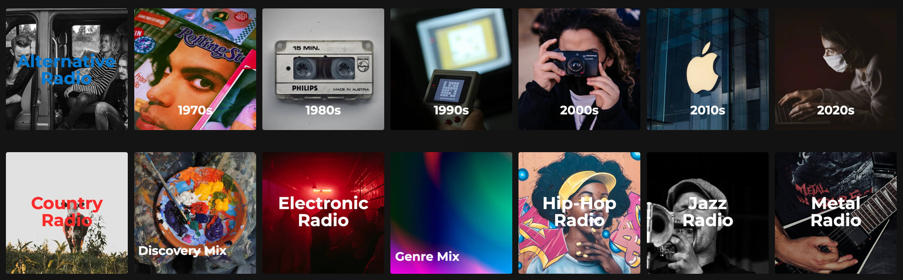

# JellyJams 🎵
<p align="center">
  
</p>

**JellyJams** is a modern, standalone Docker container that automatically generates music playlists for your Jellyfin media server using the Jellyfin REST API. It features a beautiful dark-themed web UI for easy configuration and management.




## 🐳 Quick Start

Get JellyJams running in minutes with Docker:

```bash
docker pull jonasmore/jellyjams
```

📦 **Docker Hub**: [jonasmore/jellyjams](https://hub.docker.com/r/jonasmore/jellyjams)

## ✨ Features

### 🎵 Playlist Generation
- **Multiple Playlist Types** - Genre, Year, Artist, and Personalized playlists
- **Smart Genre Grouping** - Groups similar genres into main categories to avoid overly specific playlists (e.g., "Alternative Rock", "Indie Rock", "Classic Rock" → "Rock Radio")
- **Smart Naming** - Clean playlist names ("Rock Radio", "Back to 1980", "This is Beatles!")
- **Artist Diversity Control** - Configurable minimum artist diversity for genre/year playlists
- **Discovery Playlists** - Personalized recommendations with diversity controls (max songs per album/artist)
- **Jellyfin API Integration** - Creates playlists directly via REST API with proper privacy controls

### 👤 Personalized Features
- **User-Specific Playlists** - Private playlists based on individual listening habits
- **Multiple Playlist Types** - Top Tracks, Discovery Mix, Recent Favorites, Genre Mix
- **User Selection** - Choose specific users or generate for all users
- **Listening Analytics** - Based on play counts, favorites, and recent activity
- **Plugin Requirement** - Requires [Jellyfin Playback Reporting Plugin](https://github.com/jellyfin/jellyfin-plugin-playbackreporting) for listening statistics

### 🎨 Cover Art System
- **Multi-Tier Cover Art System** - Comprehensive fallback system for all playlist types
- **Custom Generated Covers** - "This is [Artist]" text overlays on artist folder images
- **Spotify Integration** - Automatic artist playlist cover downloads from Spotify
- **Predefined Custom Covers** - Manual cover art for specific playlists
- **Smart Fallbacks** - Generic covers per playlist type ("Top Tracks - all.jpg")
- **Artist Folder Integration** - Uses existing folder.jpg from music directories
- **Unicode Support** - Handles special characters in artist names (alt‐J, Sigur Rós, etc.)
- **Extension Preservation** - Maintains original image formats (PNG, JPG)

### 🌐 Modern Web Interface
- **Beautiful Dark Theme** - Modern, responsive design
- **Real-time Dashboard** - Connection status, playlist stats, and monitoring
- **Advanced Settings** - Comprehensive configuration with live validation
- **User Management** - Select users for personalized playlists
- **Playlist Viewing** - Browse playlist contents directly in the web UI

### ⚙️ Smart Configuration
- **Web UI Override** - Settings page overrides environment variables
- **Live Updates** - Changes apply immediately without container restart
- **Comprehensive Options** - 25+ configurable settings
- **Privacy Controls** - Separate settings for public vs private playlists

### 🔄 Automation & Integration
- **Scheduled Generation** - Configurable automatic playlist updates (default: 24 hours)
- **Media Library Scan** - Automatic Jellyfin library refresh after playlist creation
- **Docker Ready** - Easy deployment with Docker Compose
- **Unraid Support** - Dedicated docker-compose configuration
- **Comprehensive Logging** - Detailed operation tracking and debugging
- **Discord Notifications** - Optional Discord webhook notifications for playlist updates and cover art changes

## 🔒 Web UI Security

JellyJams includes optional basic authentication to protect the web interface:

### Basic Authentication
- **Default**: Disabled for easy setup
- **Configuration**: Via environment variables or web UI settings
- **Override**: Environment variables take precedence over web UI settings

#### Environment Variables
```bash
WEBUI_BASIC_AUTH_ENABLED=true
WEBUI_BASIC_AUTH_USERNAME=your_username
WEBUI_BASIC_AUTH_PASSWORD=your_password
```

#### Web UI Configuration
1. Navigate to **Settings** → **Advanced Settings**
2. Enable "Basic Authentication"
3. Set username and password
4. Save settings

**Note**: Environment variables override web UI settings, allowing administrators to enforce authentication policies.

## 🎨 Cover Art System
- **Multi-Tier Cover Art System** - Comprehensive fallback system for all playlist types
- **Custom Generated Covers** - "This is [Artist]" text overlays on artist folder images
- **Spotify Integration** - Automatic artist playlist cover downloads from Spotify
- **Predefined Custom Covers** - Manual cover art for specific playlists
- **Smart Fallbacks** - Generic covers per playlist type ("Top Tracks - all.jpg")
- **Artist Folder Integration** - Uses existing folder.jpg from music directories
- **Unicode Support** - Handles special characters in artist names (alt‐J, Sigur Rós, etc.)
- **Extension Preservation** - Maintains original image formats (PNG, JPG)

### 🎯 Cover Art Priority System
1. **Custom Generated Covers** (Artist playlists)
2. **Spotify Cover Art** (Artist playlists, if enabled)
3. **Predefined Custom Covers** (Manual covers)
4. **Artist Folder Fallback** (Uses existing folder.jpg)
5. **Generic Fallbacks** (Type-specific defaults)

#### 🖼️ Custom Generated Covers
For artist playlists, JellyJams automatically generates professional "This is [Artist]" covers:
- Uses artist's existing folder.jpg as background
- Adds stylized text overlay with adaptive colors
- Handles Unicode characters (alt‐J, Sigur Rós, Mötley Crüe)
- High-quality PNG output with text shadows
- Automatic brightness analysis for optimal text contrast

#### 📁 Predefined Custom Covers
Place custom images in your cover directory (mapped to `/app/cover`):
- Exact playlist name matching: `"Top Tracks - Jonas.jpg"`
- Generic fallbacks: `"Top Tracks - all.png"`
- Decade-specific covers: `"Back to the 1990s.jpg"`
- Genre-specific covers: `"Jazz Radio.jpg"`

#### 🎵 Artist Folder Integration
JellyJams can use existing cover art from your music library:
- Searches for `folder.jpg`, `cover.jpg`, `artist.jpg` in artist directories
- Supports multiple music directory paths (`/app/music`, `/music`, `/media`, etc.)
- Case-insensitive artist folder matching
- Multiple image format support (JPG, PNG, WebP)

#### 🔄 Update Covers Feature
Refresh cover art for existing playlists without regenerating:
- **Web UI Button**: "Update Covers" on playlists page
- **Multi-tier Processing**: Tries all cover art sources in priority order
- **Progress Tracking**: Real-time feedback with statistics
- **Selective Updates**: Focuses on artist playlists for efficiency
- **Error Handling**: Graceful fallbacks with detailed logging

### 🎯 Discovery Playlist Controls
Fine-tune discovery playlists for better variety:
- **Max songs per album** (default: 1)
- **Max songs per artist** (default: 2)
- Configurable via web UI settings

### 🔄 Automatic Library Refresh
JellyJams automatically triggers a Jellyfin media library scan after playlist creation to ensure playlists appear immediately in your Jellyfin interface.

## 📁 Generated Playlists

JellyJams creates playlists in the following format:

```
📁 Playlists/
├── JellyJams Genre: Rock/
│   └── playlist.xml
├── JellyJams Genre: Jazz/
│   └── playlist.xml
├── JellyJams Year: 2023/
│   └── playlist.xml
└── JellyJams Artist: The Beatles/
    └── playlist.xml
```

### Playlist XML Format

Playlists are saved in Jellyfin-compatible XML format:

```xml
<?xml version="1.0" encoding="utf-8"?>
<playlist xmlns="http://xspf.org/ns/0/">
  <title>JellyJams Genre: Rock</title>
  <trackList>
    <track>
      <location>file:///path/to/song.mp3</location>
      <title>Song Title</title>
      <creator>Artist Name</creator>
      <album>Album Name</album>
    </track>
  </trackList>
</playlist>
```

## 🐳 Docker Deployment

### Docker Compose (Recommended)

```yaml
version: '3.8'

services:
  jellyjams:
    build: .
    container_name: jellyjams
    environment:
      - JELLYFIN_URL=${JELLYFIN_URL}
      - JELLYFIN_API_KEY=${JELLYFIN_API_KEY}
      - ENABLE_WEB_UI=true
    volumes:
      - jellyjams_playlists:/app/playlists
      - jellyjams_logs:/app/logs
      - jellyjams_config:/app/config
    ports:
      - "5000:5000"
    restart: unless-stopped

volumes:
  jellyjams_playlists:
  jellyjams_logs:
  jellyjams_config:
```

### Unraid Deployment

For Unraid users, use bind mounts to `/mnt/user/appdata/jellyjams/`:

```yaml
volumes:
  - /mnt/user/appdata/jellyjams/playlists:/app/playlists
  - /mnt/user/appdata/jellyjams/logs:/app/logs
  - /mnt/user/appdata/jellyjams/config:/app/config
```

## 🔧 API Integration

JellyJams uses the Jellyfin REST API to:

- Fetch music library metadata
- Parse genres, artists, and years
- Handle semicolon-separated genre strings
- Test connection status
- Retrieve audio item details

### Required API Permissions

Your Jellyfin API key needs access to:
- Read media library
- Access audio items
- Read metadata

## 🎨 Web UI Features

### Dashboard
- Jellyfin connection status indicator
- Playlist generation statistics
- Quick action buttons
- Real-time status updates

### Settings
- Jellyfin server configuration
- Playlist generation options
- Genre exclusion management
- Scheduling configuration

### Playlist Management
- View all generated playlists
- Filter and search playlists
- Delete unwanted playlists
- Preview playlist contents

### Logs
- Real-time log viewing
- Log filtering and search
- Download log files
- Auto-refresh capability

## 🛠️ Development

### Local Development

1. **Clone and setup:**
   ```bash
   git clone https://github.com/yourusername/jellyjams.git
   cd jellyjams
   cp .env.example .env
   ```

2. **Install dependencies:**
   ```bash
   pip install -r requirements.txt
   ```

3. **Run locally:**
   ```bash
   python webapp.py  # Web UI
   python vibecodeplugin.py  # Playlist generator
   ```

### Project Structure

```
jellyjams/
├── vibecodeplugin.py      # Main playlist generator
├── webapp.py              # Flask web UI
├── start.sh               # Container startup script
├── Dockerfile             # Container definition
├── docker-compose.yml     # Docker Compose config
├── requirements.txt       # Python dependencies
├── .env.example          # Environment template
└── templates/            # HTML templates
    ├── base.html
    ├── index.html
    ├── settings.html
    ├── playlists.html
    └── logs.html
```

## 🤝 Contributing

1. Fork the repository
2. Create a feature branch (`git checkout -b feature/amazing-feature`)
3. Commit your changes (`git commit -m 'Add amazing feature'`)
4. Push to the branch (`git push origin feature/amazing-feature`)
5. Open a Pull Request

## 📄 License

This project is licensed under the MIT License - see the [LICENSE](LICENSE) file for details.

## 🙏 Acknowledgments

- [Jellyfin](https://jellyfin.org/) - Amazing open-source media server
- [Bootstrap](https://getbootstrap.com/) - UI framework
- [Font Awesome](https://fontawesome.com/) - Icons
- [Inter Font](https://rsms.me/inter/) - Typography
- [Unsplash](https://unsplash.com/license) - Cover Images

## 📞 Support

- 🐛 **Issues**: [GitHub Issues](https://github.com/jonasmore/jellyjams/issues)
- 💬 **Discussions**: [GitHub Discussions](https://github.com/jonasmore/jellyjams/discussions)
